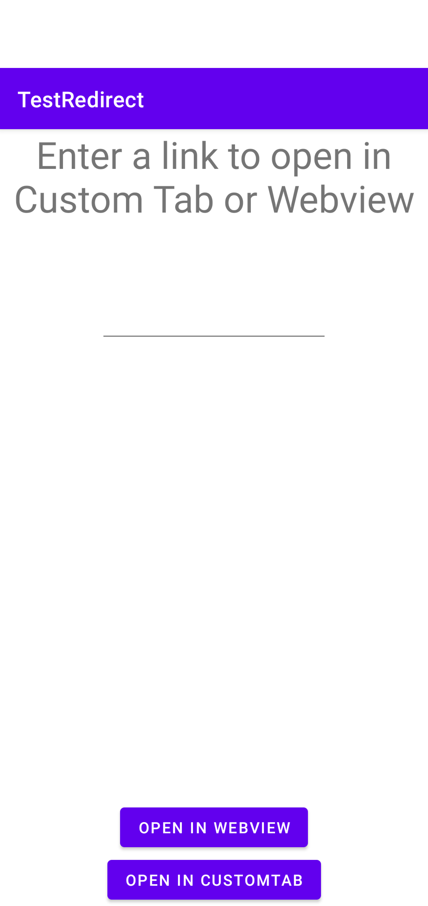

# Sample app to test redirection behaviors using Chrome Custom Tab and Webview

A reference app that shows best practices when dealing with Webviews to ensure that redirection to native bank applications work as expected

## Installation
Requires Android Studio Chipmunk+

## Contributing
Contributions are always welcome!

## License

[MIT](LICENSE)