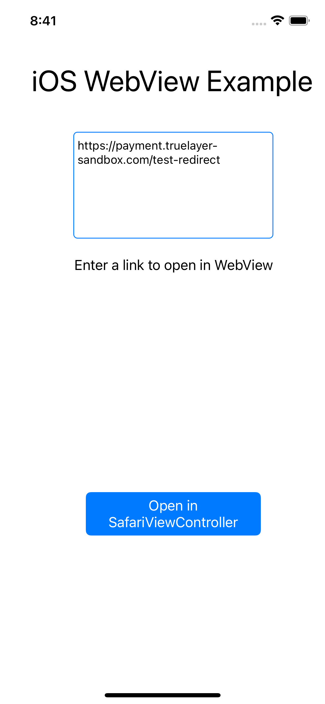
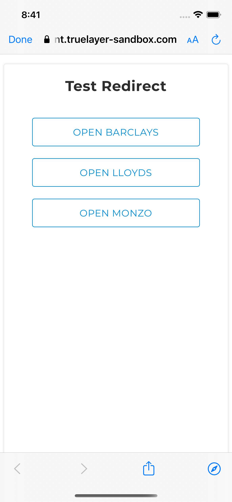

# Mobile Webview examples

Reference applications showcasing best practices when dealing with Webviews to ensure that redirection to native bank applications work as expected.

## Android

 

Requirements:
- Android: Requires [Android Studio Chipmunk+](https://developer.android.com/studio)

 
 

## iOS

 

Requirements:
- iOS: Requires [XCode Version 13.2+](https://developer.apple.com/xcode/)

 
 

## Contributing
Contributions are always welcome!

## License

[MIT](LICENSE)